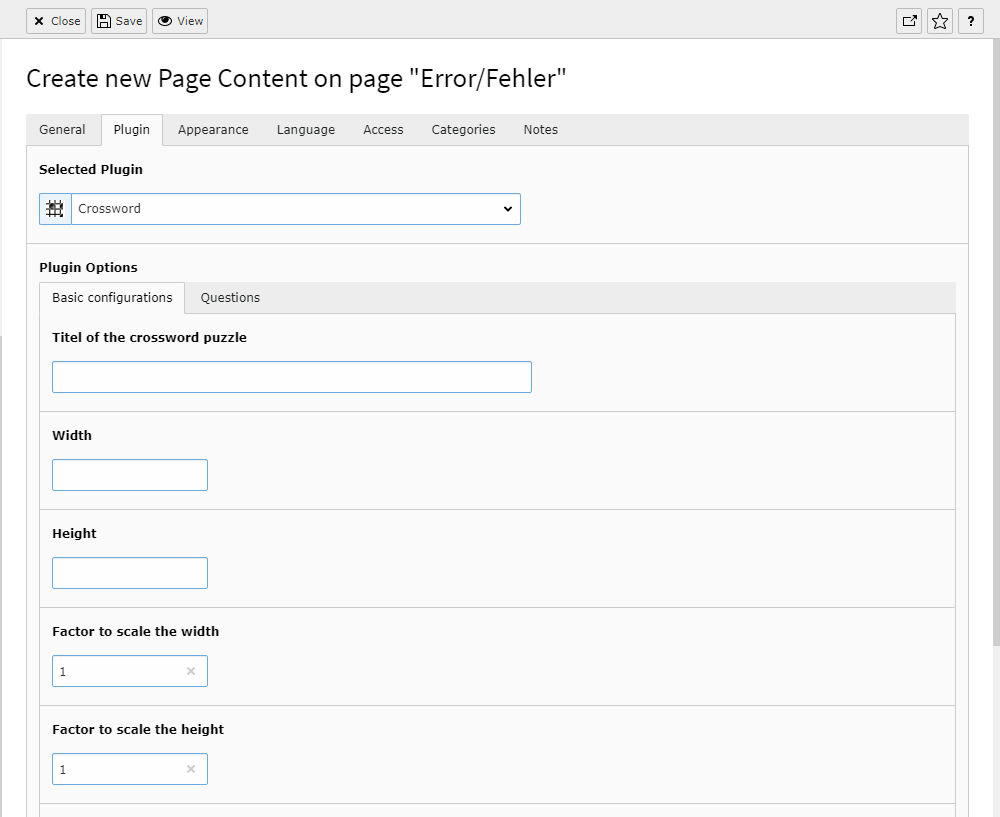
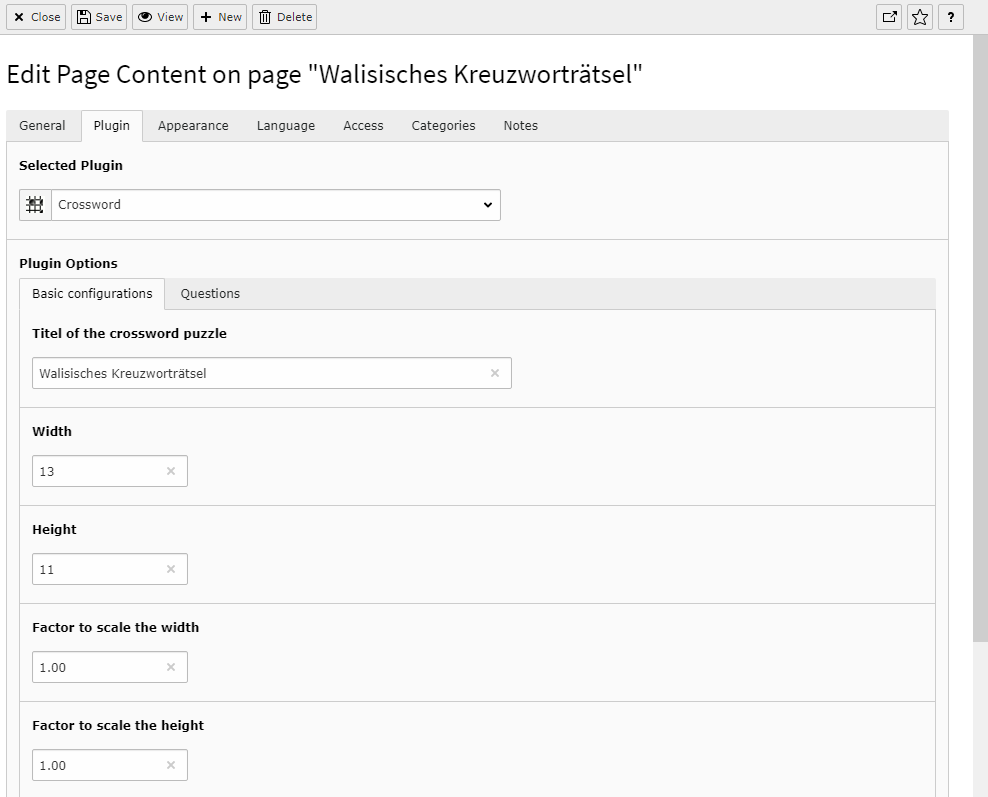
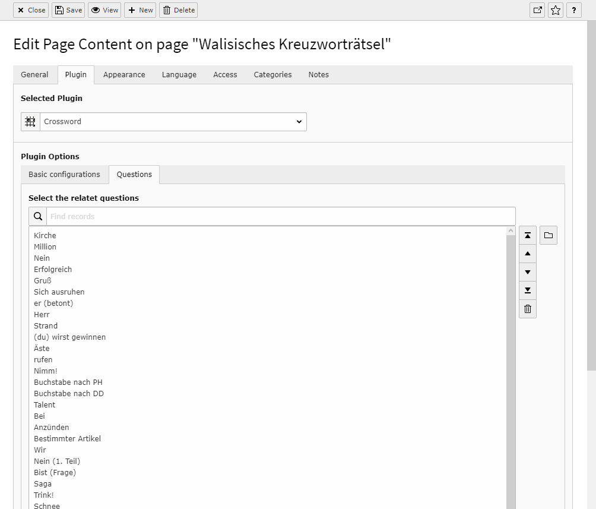

.. ==================================================
.. FOR YOUR INFORMATION
.. --------------------------------------------------
.. -*- coding: utf-8 -*- with BOM.

.. include:: ../../Includes.txt

.. _migration:

Migration for version 5.x
-----------------------------------------

If you upgrade glcrossword to version 5.x from a version below 5.0.0 then you need to reconfigure the flexform in your crossword plugin. 
The reason is that with version 5 glcrossword is based on fluid with extbase. Therefore all flexform elements need the prefix settings. 
So after an upgrade you are looking in an empty flexform.

Make before the upgrade screenshots of the old flexform with all the settings and reconfigure after the upgrade the flexform in the plugin manually.

If you have already made the update to version 5.x then don't change the flexform. You would destroy all the old information in the flexform. Make an downgrade to version 4.0.0 and make sreenshots of the flexform settings. Then make an upgrade again. 
For a downgrade to Version 4.0.0 you need to go to the module Extensions. If you have found glcrossword under "Get Extensions" you need to klick on the version number of this extension. Here you have the oportunity to install older versions.

