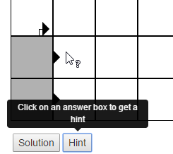
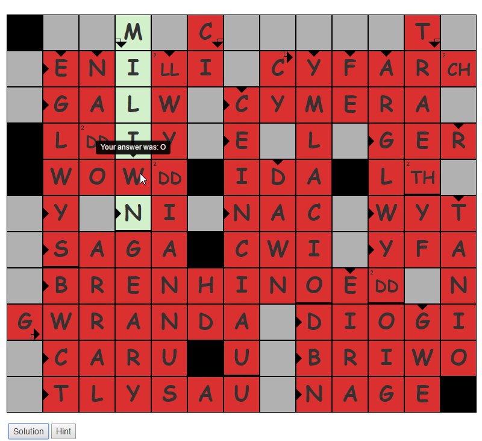

.. ==================================================
.. FOR YOUR INFORMATION
.. --------------------------------------------------
.. -*- coding: utf-8 -*- with BOM.

.. include:: ../../Includes.txt

.. _introduction-screenshots:

Screenshots
-----------

Crossword showing a question with mouse hover event.

Entering a text in edit mode.

Get a hint for a single answer field.

Get solution for the crossword and show your own letters with the mouse hover event.

You can setup the answers in every direction of the crossword.

You are able to define answer boxes with more then one letter.

.. figure:: ../../Images/image-6.png
	:alt: Answerbox with two letters
    
You can support dark color schemes

