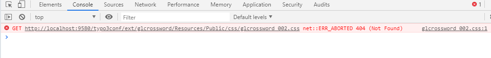

.. ==================================================
.. FOR YOUR INFORMATION
.. --------------------------------------------------
.. -*- coding: utf-8 -*- with BOM.

.. include:: ../Includes.txt

.. _troubleshooting:

Troubleshooting
===============

**Empty page**

If you get an empty crossword then check if you have access to the javascript and CSS-files. In
chrome and firefox you can do this with the help of the developertools by pressing STRG+SHIFT+J
(Chrome or Firefox). Then you can see probably the following error messages in the console tab or
browser console. If you see this errors then check Chapter :ref:`Providing access to
glcrossword resources<administration-providing-access-to>` for resolve the access problems in your apache server.

Console log with chrome.

Console log with firefox

**Crossword not response**

The crossword is displayed but not reacting. You get only a hourglass over the crossword.

If you check the error log of you apache server in /var/log/apache2/error.log then you can see
the following error “Call to a member function getQuestionsArray() on a non-object “.

::

  	[Thu Jan 02 02:10:08 2014] [error] [client w.x.y.z] PHP Fatal error: Call to a member function getQuestionsArray() on a non-object in /var/www/typo3conf/ext/glcrossword/ajax/class.tx_glcrossword_ajax.php on line 89, referer: http://my.homepage/

This error happen not every time. Sometimes it happens only with certain browsers or if you
change your IP address.

That means you are in trouble with your session data. In older versions the problem was an encoding problem with unicode, but in current versions is this
rather unlikely. Check if this issue only happens, if you hav umlauts in your crossword. In other cases maybe your browser dosn't store the session correct 
or you have problems with the typo3 cache. By default caching is deactivated for this extension.

**Hourglas is not stopping**

If you see only a turning crossword and the extension is not starting.

Then press F12 in your browser and check the console for errors.

If you can see an error like “jQuery.ajax(...).done is not a function”

You most probably have not include the jQuery library. Check if you have include the static template like in chapter :ref:`Configuration<configuration>` described.

**The crossword is starting but not responding**

If you can see a successful startet crosswords, but you can not edit any text or you can't see
any tooltips with the questions, then press F12 in your browser and check the console. If you
can see a error like “$l_objButtonHint.tooltip is not a function”, then you have not include
the bootstrap library in your homepage.

Check if you have included the static template like in the chapter :ref:`Configuration<configuration>` described.

Additionally you should check, if the constants for deactivating/activating the javascript libraries are properly set.

**Very odd presentation of the crossword**

If you can only se a very odd presentation of the crossword like that.

   
You most probably have no access to the crosswords css file under /typo3conf/ext/glcrossword/Resources/Public/css/glcrossword.css
You can check in your browser with Ctrl+Shift+J if you find error messages in your console like that.

In this case you should check your apache configuration if you have access to the public folder of this extension in the folder Resources. See the chapter :ref:`Providing access to glcrossword with Apache<administration-providing-access-to>` for that.