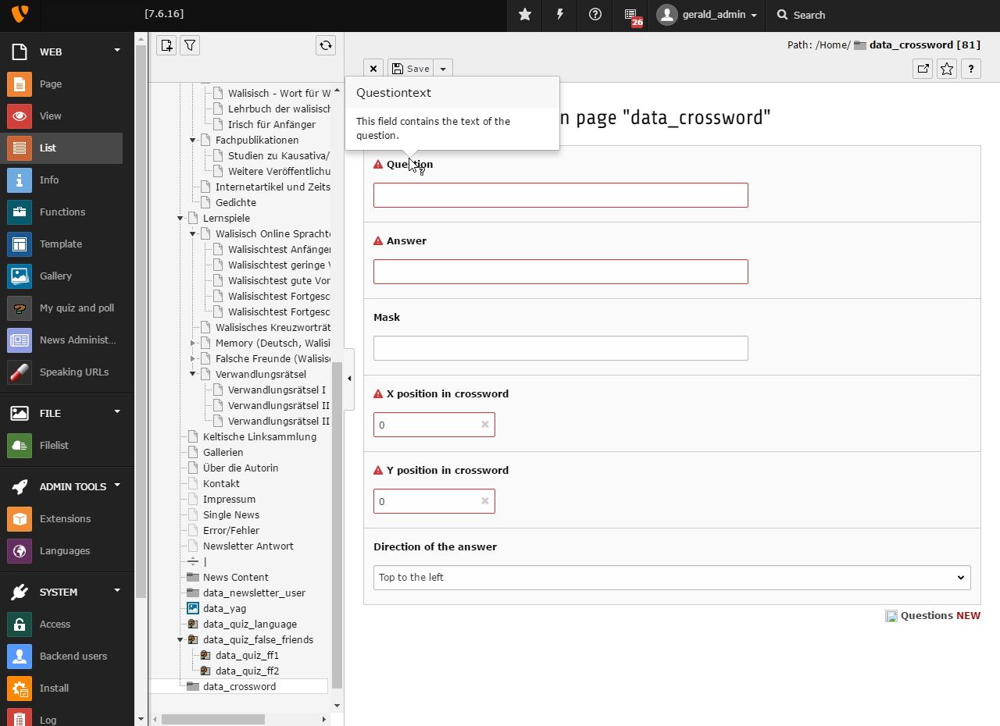

.. ==================================================
.. FOR YOUR INFORMATION
.. --------------------------------------------------
.. -*- coding: utf-8 -*- with BOM.

.. include:: ../../Includes.txt

.. _users-manual-create-a-question-object:

Create a question object
------------------------

First you need to create a new page of the type “folder”, where you can store all your
questions. Then you need to go from the List module into the folder page and press the new record
button.

Choose a question record an you get into the configuration mask of an question record.
Here you can get on the title of every field a description with the mouse cursor.

Fill all fields with the proper content and save this record. Do this again for every question in
your crossword.
