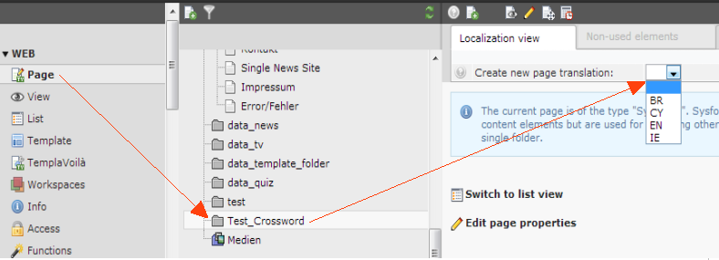
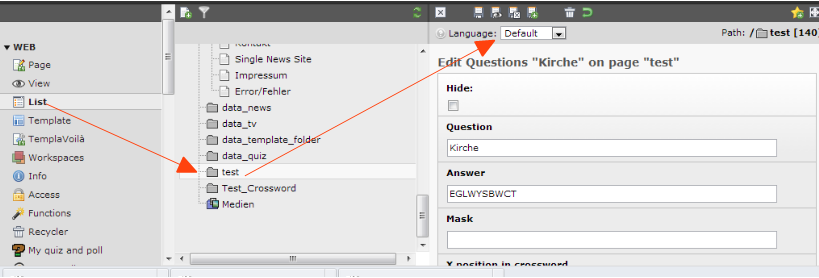
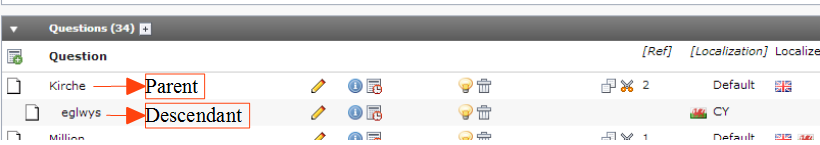

.. ==================================================
.. FOR YOUR INFORMATION
.. --------------------------------------------------
.. -*- coding: utf-8 -*- with BOM.

.. include:: ../../Includes.txt

.. _users-manual-insert-a-multi-language:

Insert a multi language crossword
---------------------------------

If you like to setup an multilingual crossword, e.g. questions in different languages but always the
same answers then you have to consider same things.

First you need to setup an working crossword with the default language. After that you need to go
from the page modul to your folder page with all your questions and then in the localization view
menu to create a new language record for this page.

After this you have in the question records a new menu at the top where you can choose the language
for this question.

If you have first build a working crossword with your default language then you can't do
anything wrong. If you like to change the assigned questions in the frontend plugin after you have
created localized questions, then you must always select the parent question for the crossword and
never a descendant. Otherwise you will miss this question on your page.

