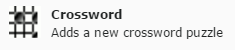
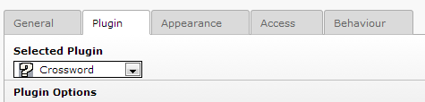
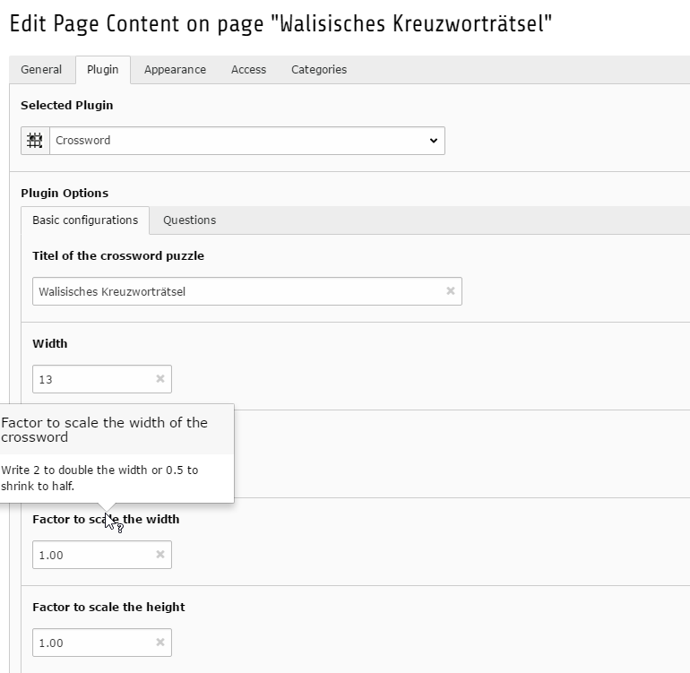
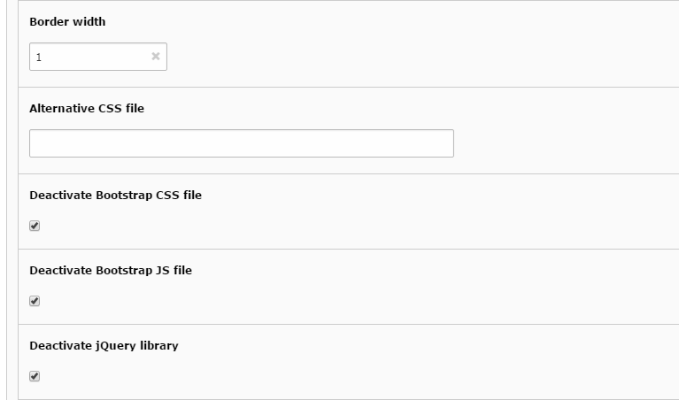
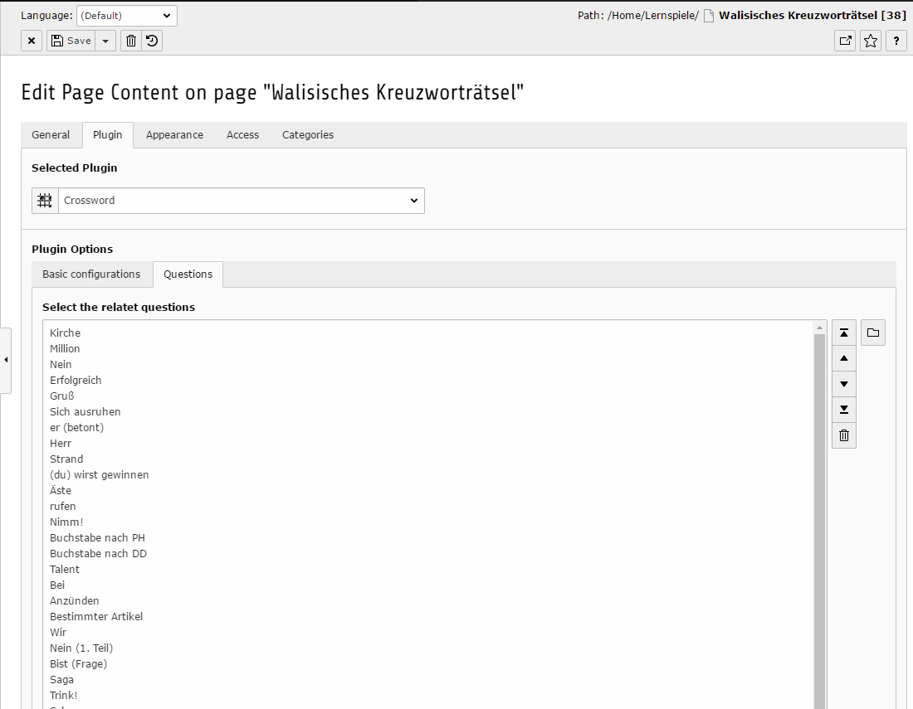

.. ==================================================
.. FOR YOUR INFORMATION
.. --------------------------------------------------
.. -*- coding: utf-8 -*- with BOM.

.. include:: ../../Includes.txt

.. _users-manual-insert-the-crossword-frontend:

Insert the crossword frontend plug-in
-------------------------------------

Go with the page modul to the page where you like to place your crossword. Press the
button for a new element .

Then on the Plugins tab, the crossword plugin.

In the tab Plugin choose Crossword as the plugin.

If you edit this element then you can find on the plugin tab the configuration for the crossword. In
the tab “Basic configurations” you can setup general options like the size of the crossword.
Again you find on every title of the fields with your mouse cursor an explanation of the options.

On the tab questions you must select all questions which you have created in the section before an
which belongs to this crossword.

Check if you already using the Bootstrap or jQuery libraries in your homepage. In this case you
can deactivate this libraries in the tab “Basic configurations” to prevent double including this
libraries (:ref:`see troubleshooting for this issue<troubleshooting>`). Be aware, that you need
jQuery 3.x and Bootsstrap 3.x. With other versions you can lead into trouble.

In the end you can access your homepage and see the result. If you have any misconfiguration you get
red highlighted boxes, where you can find further informations with the mouse cursor over the boxes.
