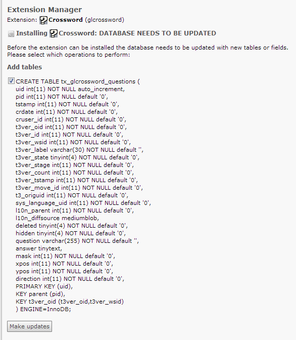
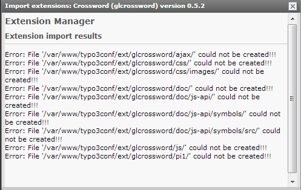

.. ==================================================
.. FOR YOUR INFORMATION
.. --------------------------------------------------
.. -*- coding: utf-8 -*- with BOM.

.. include:: ../../Includes.txt

.. _users-manual-install-the-plugin:

Install the plug-in
-------------------

Go to the extension manager and choose “import extensions” in the combo box at the top.

Looking for crossword and import this extension. After that choose “install extensions” from the
combo box and press the download button in front of the crossword extension.

In the next screen it shows to create a table in your database. Press Update and this
extension is installed.

If you get errors like “File xy could not be created!!!”, check if the file although exists and
ignore this message if the files exists. In my tests the installation always was successful even if
I got this error messages.

If the file doesn’t exists check first in the install tool if the parameter
[EXT][allowLocalInstall] is true.

If this is the case check the folder /typo3conf/ext/ if your the user of your webserver has the
right to write into it. The user of your webserve can you get under linux with the following
command. It displays all users of the apache process in the first column. Usually it is an user
other then root (e.g. www-data).

.. code-block:: bash

    $ ps aux | grep apache
